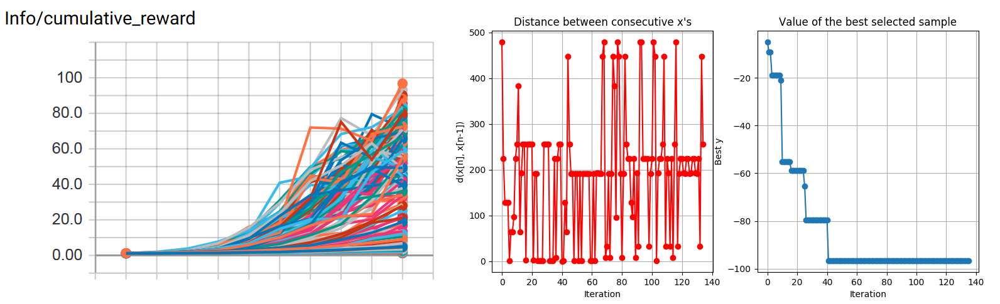

# GPyOpt-ml-agents
Gaussian process optimization using [GPyOpt](https://github.com/SheffieldML/GPyOpt) for [Unity ML-Agents Toolkit](https://github.com/Unity-Technologies/ml-agents/).

If you are fed up with tuning your ml-agents training parameters by hand, this repository is made for you!

## Requirements
Follow the ml-agents installation documentation to install it as a python module:
[Link](https://github.com/Unity-Technologies/ml-agents/blob/master/docs/Installation.md)


And install repository dependencies:
```
pip install -r requirements.txt
```

## Usage
Since Unity ML-Agents is using grpc, make sure you do not have any set proxy.

The parameters contained in the config `trainer_config.yaml` is used as default when the parameters are not specified.

The code uses a slightly modified ml-agents `learn.py` which accepts an additional parameter to specify the trainer config file.

###  Gaussian process optimization
Modify the config file `hyperopt_conf.py` to fit your environment and run
```
python hyperopt.py (<env>)
```
The optimization algorithm will explore the parameters space and try to maximize the final reward at `max_steps`. The reward is read in the tensorboard summary event file.

The `batch_size` variable specifies the number of instances launched in parallel.
The total number of trains will be  `batch_size` * `max_iter` + `batch_size` as the algorithm will run an initial batch to collect points before running the optimization.

For more details, see [GPyOpt](https://github.com/SheffieldML/GPyOpt) documentation

### Grid search
If your training is too long to run multiple iterations, you can always use the grid search.

Specify your hyperparameter space dict as `params_grid` in `grid_search_conf.py` and run
```
python grid_search.py (<env>)
```

The grid search currently runs in parallel all the combinations of the parameters space without taking into account the number of CPU core, so beware to not specify a too large search space.

You can stop the training to generate the graph for each instance whenever you want using a simple `CTRL+C`.


## Example

### ml-agents 3DBall environment

We are searching for the best hyperparameters that maximize the reward at 10k steps.

Config and Parameter space:
```
definition = [{
  'name': 'learning_rate',
  'type': 'continuous',
  'domain': [1e-5, 1e-3]
}, {
  'name': 'epsilon',
  'type': 'continuous',
  'domain': [0.1, 0.3]
}, {
  'name': 'gamma',
  'type': 'continuous',
  'domain': [0.8, 0.995]
}, {
  'name': 'lambd',
  'type': 'continuous',
  'domain': [0.9, 0.95]
}, {
  'name': 'num_epoch',
  'type': 'discrete',
  'domain': [3, 10]
}, {
  'name': 'beta',
  'type': 'continuous',
  'domain': [1e-4, 1e-2]
}, {
  'name': 'num_layers',
  'type': 'discrete',
  'domain': [1, 3]
}, {
  'name': 'hidden_units',
  'type': 'discrete',
  'domain': [32, 64, 128, 256, 512]
}]

batch_size = 8
num_cores = 32
max_iter = 16
```

Optimal params found achieving `96.80000305175781` as mean reward:
```
learning_rate: 1.0e-03 
epsilon: 0.3
gamma: 0.995
lambd: 0.95
num_epoch: 3
beta: 1.0e-02
num_layers: 3
hidden_units: 256
```


